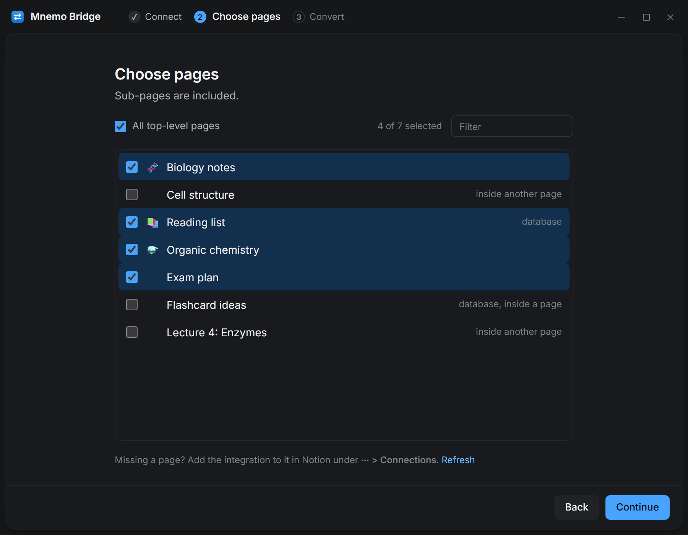
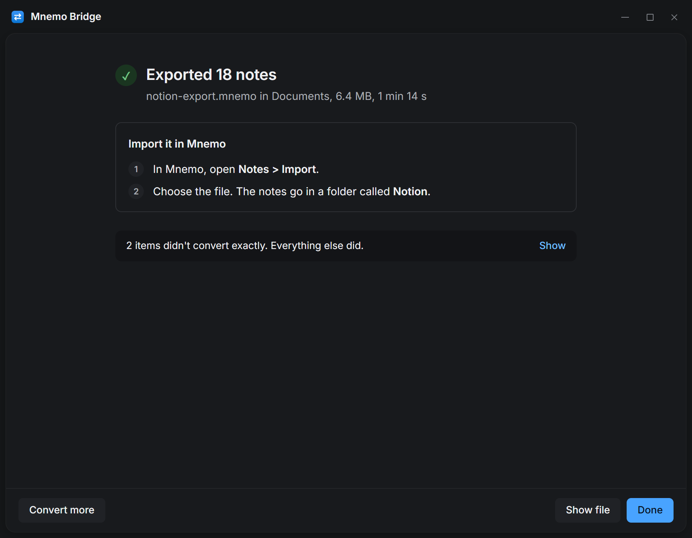

# Mnemo Bridge

Moves notes between [Mnemo](https://github.com/onemnemo/mnemo) and other apps and keeps the formatting. It supports [Notion](https://www.notion.com) in both directions, carrying equations, text and background colours, headings, callouts, tables, columns, images, sub-pages, tags and page icons.

Notion to Mnemo writes a `.mnemo` package that you import from **Notes > Import** in Mnemo. Mnemo to Notion creates real pages through Notion's API and uploads the images.

Everything runs on your machine. The only traffic is between your machine and Notion's API. There is no account and no tracking.

<p align="center">
  
  
</p>

## Install

Download the app from the [latest release](https://github.com/onemnemo/mnemo-bridge/releases/latest). Installed copies check for a new version when they start and ask before updating.

- **Windows:** run `MnemoBridge-win-Setup.exe`. Windows may warn about an unknown publisher because the Windows build isn't code-signed yet. The portable zip works without installing but doesn't update itself.
- **macOS (Apple Silicon):** open `MnemoBridge-osx-Setup.pkg`.
- **Linux:** download `MnemoBridge-linux.AppImage`, run `chmod +x` on it and start it. If your distribution asks for FUSE, install `libfuse2`.

To run from source:

```bash
pip install -r requirements-gui.txt
python -m mnemo_bridge gui
```

## Connect Notion

You do this once, and it takes about two minutes.

1. Create an integration at [notion.so/my-integrations](https://www.notion.so/my-integrations) and copy its secret.
2. In Notion, open each top-level page you want to move and choose **⋯ > Connections** and your integration. Pages inside it come along.
3. Paste the secret into the app.

Mnemo to Notion also needs the integration's insert content capability, which new integrations have by default, and the integration must be connected to the page you import under.

When you tick **Remember**, the app keeps the key in the system keychain (Windows Credential Manager, macOS Keychain or the Secret Service on Linux). Without a keychain it uses `~/.mnemo-bridge/config.json`.

## Command line

The command line does everything the app does. `python -m mnemo_bridge --help` lists the commands, and `python -m mnemo_bridge notion pull --help` lists every export option.

```bash
pip install -r requirements.txt
export NOTION_TOKEN=ntn_...            # PowerShell: $env:NOTION_TOKEN = "ntn_..."

# Notion to Mnemo, everything the integration can see
python -m mnemo_bridge notion pull -o notes.mnemo

# Only some pages or databases (URLs or ids, repeatable)
python -m mnemo_bridge notion pull --page https://www.notion.so/My-Page-abc... --covers
python -m mnemo_bridge notion pull --database 1234abcd... --db-properties none

# Mnemo to Notion, under a parent page
python -m mnemo_bridge notion push notes.mnemo --parent https://www.notion.so/Imports-...
```

Exporting caches API responses in `.notion-cache/`, so running it again costs no API calls. Pages you edit in Notion afterwards are not refreshed, so pass `--no-cache` or delete the folder to pick up changes. Image links that have expired are fetched again.

A push that stops partway keeps the pages it already created in Notion. Delete them before running it again, or they are created twice.

## What carries over

### Notion to Mnemo

| Notion | Mnemo | Notes |
| --- | --- | --- |
| Paragraph, headings 1 to 3 | `Text`, `Heading1` to `Heading3` | |
| Bulleted and numbered lists | `BulletList`, `NumberedList` | Nesting kept |
| To-do | `Checklist` | Checked state kept |
| Quote, divider | `Quote`, `Divider` | |
| Callout | `Callout` | Emoji kept. Red, orange and yellow become the warning tone |
| Code | `Code` | Language and caption kept |
| Equation block and inline equation | `Equation`, `EquationSpan` | LaTeX kept as written |
| Image | `Image` | Downloaded into the package, caption kept |
| Table | `Table` | Header row and header column |
| Columns | `TwoColumn` | Widths kept. Three or more columns nest |
| Sub-page | Sub-note and `Page` block | Nesting and position kept |
| Synced block | Its content | |
| Toggle | Text with its contents nested | The fold is lost |
| Database | Folder of notes | Select fields become tags, other fields a table at the top of each note |
| Page icon and cover | Note emoji and cover | Covers with `--covers` |
| Bookmark, embed, video, file | Text with a link | |

Bold, italic, underline, strikethrough, inline code, links, text colour and background colour carry over everywhere.

### Mnemo to Notion

| Mnemo | Notion | Notes |
| --- | --- | --- |
| Text, headings, lists, quote, divider | The same | `Heading4` becomes heading 3, since Notion has three levels |
| Checklist | To-do | State kept |
| Code | Code | Language and caption kept |
| Equation | Equation | Notion allows 1000 characters. Longer ones become code with a warning |
| Image | Image | Uploaded to Notion, caption kept |
| Callout | Callout | Emoji and tone kept |
| Table | Table | Notion only supports a header row and a header column |
| TwoColumn | Columns | Width ratio kept |
| Sub-note | Child page at its position | |
| Folder | A page holding its notes | Notion has no folders |

### Colours

Mnemo stores colours as theme tokens and Notion has nine fixed colours. Both directions match on hue, so a note that goes to Mnemo and back keeps its colours. Three pairs of Notion colours share a Mnemo colour because Mnemo has no brown, as listed in [`colors.py`](mnemo_bridge/sources/notion/colors.py). `--color-map FILE` overrides the mapping.

Notion text has either a text colour or a background, not both. A Mnemo span with both keeps the background.

### What doesn't carry over

- Whether a toggle is open or closed.
- Files Notion hosts other than images (PDF, video, uploads). Their links expire within an hour, so they become links and are listed in the warnings.
- Database views, filters, formulas and relations. The rows and their current values come across.
- Buttons, AI blocks and anything Notion's API reports as unsupported.

Anything skipped is listed in the warnings. The app shows them, and the command line writes them next to the output file.

## Exporting again

Note ids come from Notion ids, so exporting twice gives the same ids. Import into Mnemo with the Overwrite policy to update notes instead of duplicating them. Unchanged content gives an identical package.

## Development

```bash
pip install -r requirements-dev.txt
python -m unittest discover -s tests -t .     # no network or Notion key needed
python -m mnemo_bridge gui
pyinstaller mnemo-bridge.spec                 # builds into dist/MnemoBridge/
```

The tests check the JSON against what Mnemo's `BlockJsonConverter` reads, so a format change on either side fails a test here.

Everything Mnemo-specific sits at the top of `mnemo_bridge/`. Each app it converts to and from has its own folder under `sources/`.

| Module | What it does |
| --- | --- |
| `mnemo.py` | Mnemo's note model and its JSON |
| `package.py` | Reading and writing `.mnemo` packages |
| `updates.py` | Self-update through Velopack |
| `cli.py` | The command line, one command per source |
| `gui/` | The desktop app. `gui/notion.py` is the Notion part of its bridge |
| `sources/notion/client.py` | API client with throttling, retries and the cache |
| `sources/notion/walker.py` | Finding pages, folders, sub-pages and databases |
| `sources/notion/convert.py` | Notion blocks to Mnemo blocks |
| `sources/notion/richtext.py` | Notion rich text to Mnemo spans |
| `sources/notion/colors.py` | Colour mapping between the two |
| `sources/notion/assets.py` | Images and Mnemo asset ids |
| `sources/notion/reverse.py`, `reverse_text.py` | Mnemo blocks and text to Notion blocks |
| `sources/notion/push.py`, `push_layout.py` | Writing to Notion within its request limits |
| `sources/notion/cli.py` | The `notion pull` and `notion push` commands |

### Adding a source

1. Put the conversion in `sources/<name>/`, reading and writing Mnemo packages through `package.py`.
2. Add a `<name>` command in `cli.py`.
3. In the app, add a bridge mixin in `gui/<name>.py` with methods prefixed `<name>_`, a group of choices on the start screen in `index.html`, and an entry in `SOURCES` in `app.js` naming its first screen and its steps.

The app icon is drawn by [`tools/make_icons.py`](tools/make_icons.py). Run it again after changing the design.

## Releasing

Bump `__version__` in [`mnemo_bridge/__init__.py`](mnemo_bridge/__init__.py) and push a matching tag:

```bash
git tag v1.2.0
git push origin v1.2.0
```

[`release.yml`](.github/workflows/release.yml) builds on Windows, macOS and Linux, runs the tests, starts each built app once, packs it with [Velopack](https://velopack.io) and publishes one release. It stops if the tag and `__version__` disagree. To build without releasing, run the workflow from the Actions tab with **publish** off and download the builds from the run.

Each installed app reads its own update feed (`releases.win.json`, `releases.osx.json` or `releases.linux.json`) from the release, so publishing the release ships the update.

- **macOS** is signed and notarized with the organization's `MACOS_*` and `APPLE_API_*` secrets, the same ones Mnemo uses. Without them the build ships as an unsigned `.app` in a zip that doesn't update itself.
- **Windows** is not signed yet. A certificate would go in through `vpk pack --signParams`.
- **Pre-releases:** a tag such as `v1.1.0-beta` publishes as a GitHub pre-release. Installed apps ignore those unless `PRERELEASE` in [`updates.py`](mnemo_bridge/updates.py) is on.
- **The pack id is permanent.** Installed apps find updates by `MnemoBridge`, so changing it cuts them off.

## Troubleshooting

**The integration can't see any pages.** Open the page in Notion and add your integration under **⋯ > Connections**. Each top-level page needs it.

**Mnemo won't import the package.** Tables need a Mnemo version from mid-2026 or later.

**A database is missing.** If it has more than one data source, pass `--notion-version 2025-09-03`.

**Mnemo to Notion says 404.** The parent page isn't connected to the integration.

## License

[Apache-2.0](LICENSE), the same as Mnemo.
